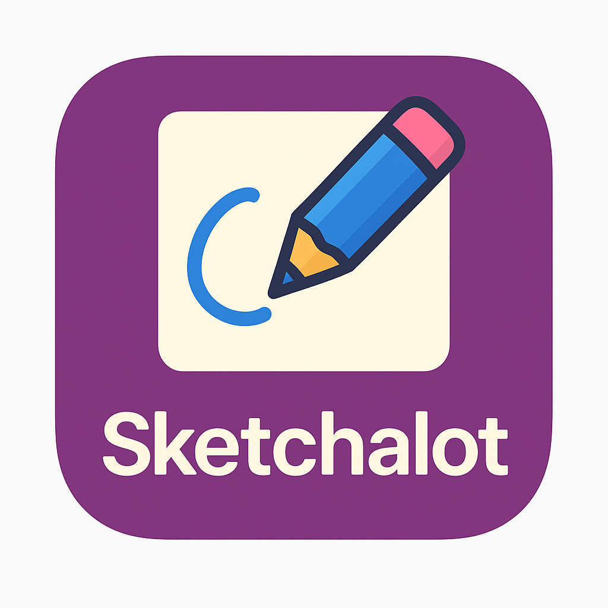
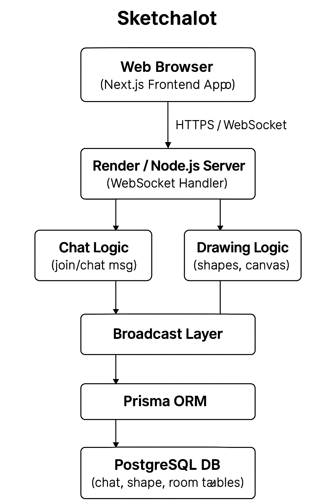

> **Real-time collaborative canvas ** powered by **WebSockets**, **Next.js**, and **Prisma**. Designed for seamless multi-user interaction with persistent drawing and messaging capabilities.

---

## 🚀 Features

- 🎨 **Live Drawing Tools**: Rectangle, Circle, Pencil, Eraser, Arrows, Slash.
- 🧑‍🤝‍🧑 **Room-based Collaboration**: Join specific rooms and collaborate in real time.
- 🔒 **Stateless Authentication (Optional)**: Token support for future secure sessions.
- 🗃️ **Persistent Storage**: All messages and shapes are stored using **Prisma** with a **PostgreSQL** database.
- ⚡ **WebSocket Powered**: Instant updates via a highly responsive WebSocket backend.

---

## 🛠️ Tech Stack

| Layer       | Stack                                      |
|-------------|--------------------------------------------|
| **Frontend**| `Next.js (App Router)` + `TailwindCSS`     |
| **Backend** | `Node.js` + `Express` + `ws (WebSocket)`   |
| **Database**| `PostgreSQL` with `Prisma ORM`             |
| **Infra**   | Monorepo-based setup using Turborepo       |
| **Auth**    | JWT (optional, currently disabled for ease)|

---

## 🧠 Architecture Overview



---

## 📦 Installation

### 1. Clone the Monorepo

```bash
git clone https://github.com/i-ayushh18/sketchalot.git

```

### 2. Install Dependencies

```bash
pnpm install
```

Make sure to have `pnpm`, `Node.js` (v18+), and `PostgreSQL` installed.

---

## ⚙️ Setup Environment Variables

### Backend (`apps/ws-backend/.env`)

```env
DATABASE_URL=postgresql://<user>:<password>@localhost:5432/<db>
JWT_SECRET=your_secret_key   # Optional
PORT=8080
```

Initialize Prisma:

```bash
pnpm prisma migrate dev --name init
```

---

## ▶️ Running the App Locally

### 1. Start WebSocket + HTTP Backend

```bash
pnpm --filter backend dev
```

### 2. Start Next.js Frontend

```bash
pnpm --filter web dev
```

Navigate to:

```
http://localhost:3000
```

You should now see the canvas and be able to draw and chat in real time.

---

## 💡 Development Notes

- Token validation is currently disabled for open access.
- To re-enable token-based auth, uncomment the `checkUser(token)` logic in the WebSocket server.
- Rooms are dynamically joined and left via WebSocket events (`join_room`, `leave_room`).

---

## 🧪 Example WebSocket Payloads

### Join Room

```json
{
  "type": "join_room",
  "roomSlug": "design-team"
}
```


### Draw Shape

```json
{
  "type": "shape",
  "roomSlug": "design-team",
  "shape": {
    "type": "rect",
    "x": 100,
    "y": 150,
    "width": 80,
    "height": 40
  }
}
```

---
