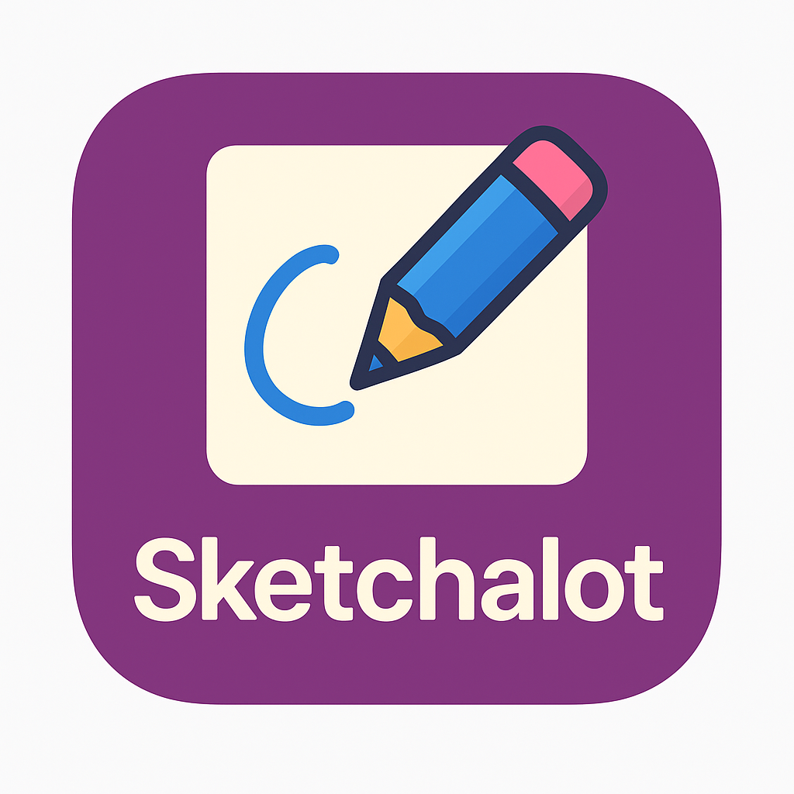
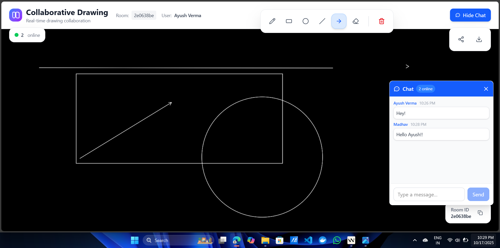

# 🎨 Sketchalot - Collaborative Sketch Board

|  |  |
| -------------------------- | -------------------------- |

A real-time collaborative drawing application built with Next.js, WebSockets, and modern web technologies. Create and join drawing rooms to collaborate with others in real-time!

## 🚀 Quick Start

### 1. Clone and run with Docker
```bash
git clone <repository-url>
cd sketchalot
docker build -t sketchalot .
docker run -p 3000:3000 -p 3001:3001 -p 8080:8080 -p 8081:8081 sketchalot
```

### 2. Access the app
- **Frontend**: http://localhost:3000
- **HTTP Backend**: http://localhost:3001  
- **WebSocket Backend**: ws://localhost:8080

### 3. Start drawing!
1. Open http://localhost:3000
2. Enter your name to join
3. Create a new room or join an existing one
4. Start collaborating in real-time!

## 🛠️ Manual Setup (Alternative)

```bash
pnpm install
cd apps/http-backend && pnpm dev &
cd apps/ws-backend && pnpm dev &
cd apps/frontend && pnpm dev
```

## ✨ Features

- Real-time collaborative drawing
- Multiple drawing tools (Pencil, Rectangle, Circle, Line, Arrow, Eraser)
- Live chat system
- Room-based collaboration
- Professional UI similar to Excalidraw

## 🏗️ Tech Stack

- **Frontend**: Next.js 14 + React + TypeScript + Tailwind CSS
- **HTTP Backend**: Node.js + Express
- **WebSocket Backend**: Node.js + WebSocket
- **Package Manager**: pnpm

---

**Happy Drawing! 🎨✨**
